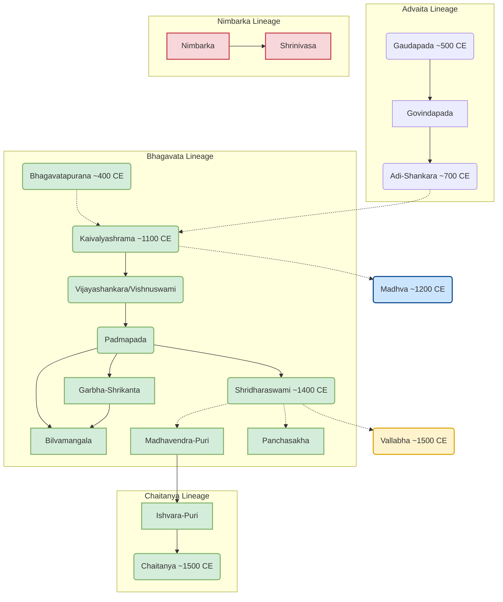

+++
title = "BhAgavata pAncharAtra sampradAya bhedaH"
js_extras = ["mermaid"]
+++

Thread by @accelerator00_ on Thread Reader App – Thread Reader App

While initially the terms "Pancharatra" & "Bhagavata" referred to the same Vaishnava sect that was born after Vaikhanasa, we find texts & scholars of later times like in Ananda Samhita of Vaikhanasa distinguishing b/w the 2.

विश्वास-टिप्पनी

This is just incorrect. pAncharAtra from SYV is as ancient as vaikhAnasa from KYV.  [TW](https://x.com/blog_supplement/status/1954742845752885557)

Both Pancharatra & Bhagavata sects are almost identical in ontology & theology, with Vasudeva being Brahman & belief in 27 tattva system. Table lists the fundamental areas that differentiate them.

|          | Pancharatra            | Bhagavata               |
|:---------|:-----------------------|:-------------------------|
| **Sect** | Pancharatra            | Bhagavata               |
| **Yoga** | Tantric/Devata         | Bhakti                  |
| **Moksha** | Identity with Vasudeva | Service of Vasudeva     |

विश्वास-टिप्पनी

moxa row in the difference table is oversimplified and hence wrong.

## Ritual differences
These differences led to creation of worship processes distinct from the Pancharatra samhitas- the most well known cases being Tantrasarasangrah of Madhvacharya & Pushtimarga of Vallabhacharya.

## Main texts
The foundational texts of this Bhagavata sect are the Badarayana sutras (in its final form) & Bhagavata Purana (core), both of which existed by at least 450 AD and are classified under bhedabheda vedanta by academic scholars.

## mAdhva emergence
Bhagavatas as a separate sect are first attested in 12th century Tulunadu with Kaivalyashrama Swami where they were absorbed by Shankarites from the get go, becoming Bhagavata-smartas who followed a mix of Shankarite & Krishnaite beliefs. In the 13th century Madhva born among this group rebelled against the very concept of Advaita & established dvaita vedanta, converting fellow bhagavata-smartas to his new sampradaya.

## Bhagavata-smartas
During same period, Vidyashankara Tirtha popularly known as Vishnuswami created a Nrsimha/Krishna brand of kevaladvaita, & with his disciple Padma Tirtha also called Padmapada absorbed the Bhagavata-smartas of Tulunadu.

The Vishnuswami sect had extremely minute differences from the mainstream Shankarites and both shared the same maths, acharyas & texts.

## Padmapada
Padmapada also established the Shankarananda math in Odisha which Shridharaswami, the famous bhashyakara of Bhagavata purana belonged to.

Shridharaswami's tradition led to development of mainly 3 theological schools during the same time period:

1. Vallabha- Rejected Shridharaswami
2. Chaitanya- Accepted his writings for the most part barring few places.
3. Panchasakhas- 5 Odia poets who followed him as it is.

The Badarayana sutras have vaishnava inclination as it is shown in the early commentaries which include the bhagavata purana too. 

## nimbArka
Nimbarkacharya created a parallel Bhagavata sect to bhagavata purana. His sampradaya never bothered to use the purana till Keshava Kashmiri who was initially a Pancharatrika joined the sect.

## Chart

The chart traces development of Bhagavata group & its subsects.

Solid Arrow: Immediate disciple  
Dotted Arrow: Not immediate disciple  
Black: Non-bhagavata Kevaladvaita  
Dark Green: Bhagavata-smarta movement. Circles imply that the name refers to not a person but group of people.

Red: Nimbarka sampradaya  
Blue: Madhva sampradaya  
Orange: Vallabha sampradaya  
Light Green: Chaitanya sampradaya  

## References 
1. "Radha-Krsna's Vedantic debut" by Vijay Ramnarace
2. "Ancient Karnataka- History of Tuluva" by BA Saletore
3. "The Visnusvamin Riddle" by Rai Bahadur Amarnath Ray

Many others for dates

Grateful to @shardula23 & @KalingaKurma for resources & additional information
